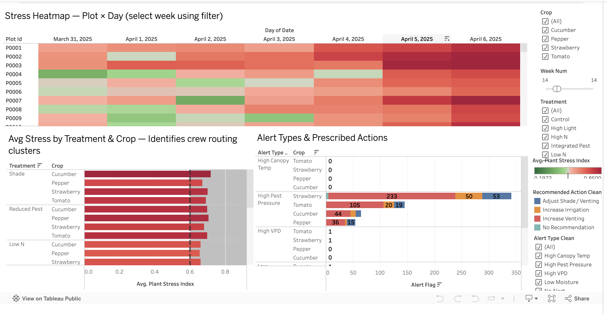
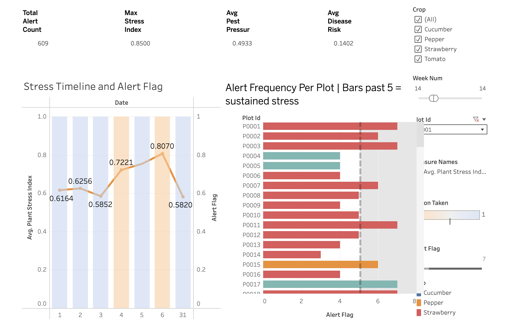
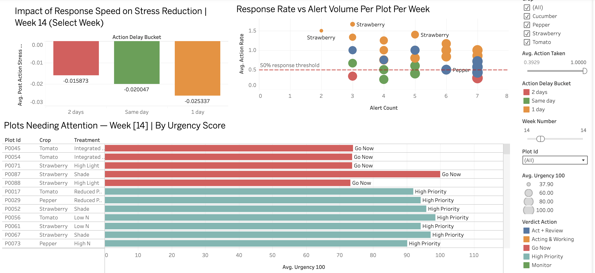
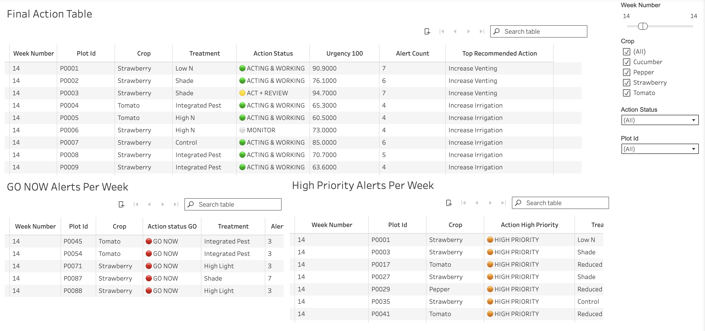

# RBC x BCCAI Analytics Hackathon SFU Beedie 2026

## The Central Question
Can precision agriculture technology meaningfully improve independent farmers' financial decision-making — and can that value be demonstrated with data?
This is answered through the lens of GreenLeaf CEA, a hypothetical controlled environment agriculture operator running 8 farms, 20 greenhouses, and 120 experimental microplots across British Columbia.

## Tableau Dashboards:
https://public.tableau.com/app/profile/lavika.singh5082/viz/Dashboard1_17820713582910/Branch1AlertVolumeSeverity1?publish=yes
https://public.tableau.com/app/profile/lavika.singh5082/viz/Dashboard1_17820713582910/Branch1AlertVolumeSeverity2?publish=yes
https://public.tableau.com/app/profile/lavika.singh5082/viz/Dashboard1_17820713582910/Branch2ResponseSpeedActionRate?publish=yes
https://public.tableau.com/app/profile/lavika.singh5082/viz/Dashboard1_17820713582910/Dashboard4?publish=yes

## Approach 

### Question A: Weekly Alert Triage:  "Where should the farmer act first this morning?"
A greenhouse operations manager arrives Monday morning. Sensor alerts have been firing across many plots all week. Labor is limited. The question is not whether to act — it is where to act first, and why. Our dashboard answers that question with data, not instinct.

#### Branch 1 — Alert Volume & Severity
What is happening this week and how bad is it?
1. V1 Stress Heatmap — Plant stress index per plot per day, coloured green to red. Key finding Week 14: 486 of 840 plot-days above 0.6 stress threshold.

2. V2 Alert Type Breakdown — Alert count by type and crop, stacked by recommended action. Key finding: 98% of alerts = High Pest Pressure → Increase Venting.

3. V3 Stress by Treatment and Crop — Avg stress index by treatment group. Key finding: Shade (0.699) and Reduced Pest (0.690) highest stress.

4. V4 KPI Tiles — Total alerts, max stress, avg pest pressure, avg disease risk. Key finding Week 14: 609 alerts, max stress 0.85, pest pressure 0.49.

5. V5 Stress Timeline — Per-plot daily stress line with alert and action day overlays. Key finding: P0087 stress rose to 0.81 with only 29% of alerts acted on.

#### Branch 2 — Response Speed & Action Rate
Is the team keeping up, and does speed matter?
1. V6 Response Rate Scatter — Alert count vs action rate per plot. Bottom-right quadrant = ignored plots. Key finding: 5 plots in Go Now zone with high alerts and action rate below 40%.
2. V7 Delay Impact — Stress improvement by response speed bucket. Key finding: Same-day response produces stress delta of −0.049. Two-day delay produces −0.011. Speed cuts effectiveness by 78%.
3. V8 Ranked Plot List — All plots sorted by urgency score with verdict badge. Key finding: P0087 rank 1, urgency score 100, action rate 29%, verdict Go Now.

#### Urgency Score — How We Ranked the Plots
The ranked list is driven by a composite urgency score calculated per plot per week from four components drawn from daily_sensor_readings:

Urgency Score = (0.40 × Max Stress Index) + (0.25 × Alert Frequency Rate) + (0.20 × Response Gap) + (0.15 × Delay Penalty)

#### Component definitions
1. Max stress index = max(plant_stress_index) for the week. Captures severity of plant health damage. Weight 0.40.
2. Alert frequency rate = alert_count divided by days_observed. Captures whether this is a sustained problem or a single spike. Weight 0.25.
3. Response gap = 1 minus (action_count divided by alert_count). Captures the fraction of alerts left unanswered. Weight 0.20.
4. Delay penalty = avg(action_delay_days) divided by 2, normalised to 0–1 scale. Captures speed of response. Weight 0.15.

All components are on a 0–1 scale before weighting. The final score is rescaled to 0–100 for readability.

Why these weights
1. Stress carries the highest weight (0.40) because it is the direct measure of plant damage — it is what the manager is ultimately trying to prevent.
2. Response gap (0.20) captures which plots are being systematically ignored, which compounds risk over time.
3. Alert frequency (0.25) separates a persistent crisis from a one-day anomaly.
4. Delay (0.15) matters but is the least important of the four — acting one day late is worse than same-day, but the plot still needs attention regardless.

These weights are analytical judgement calls grounded in the case logic, not agronomic standards. They are intentionally tunable — a manager who prioritises response speed over raw stress can increase the delay weight. The model is a decision support tool, not a black box.

## Dashboard Previews

### Branch 1 — Alert Volume & Severity

### Branch 2 — Response Speed & Action Rate

### Final Action List

## How to Reproduce the Analysis

1. Clone this repo
2. Open RStudio
3. Install dependencies: `install.packages(c("tidyverse", "corrplot", "RColorBrewer"))`
4. Open `greenleaf_analysis_v2.Rmd`
5. Set your working directory to the repo folder
6. Click **Knit** — this runs all analysis and regenerates both dashboard CSVs

## R Notebooks — View Online

| Notebook | Description |
|----------|-------------|
| EDA | Stress distribution, alert analysis, correlation matrix |
| Trend Analysis | Weekly stress trends, delay impact, ROI by action rate |
| Financial Analysis | Season profitability, market prices, treatment ROI |

